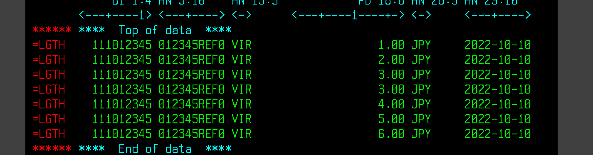
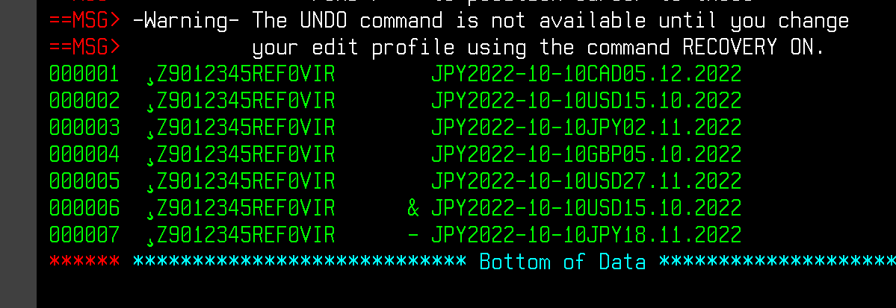
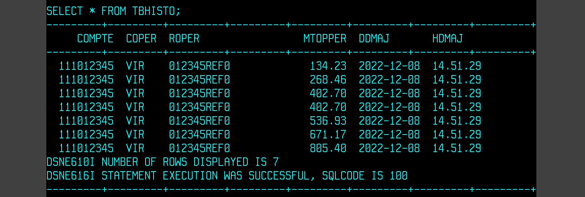

# Première partie DB2

## Table of Contents
- [01 - Preparation](#01)
- [02 - Programme COBOL](#02)
- [03 - Suite](#03)
- [04 - Résultat](#04)

## 01 - Preparation <a name = "01"></a>

### a) Préparation de votre Fichier d'entrée

Ici, le format des valeurs est assez compliqué à manipuler manuellement.   
Vous pouvez récuperer la structure de données : <a href="./01 - PGM017FC">Fichier COPY</a>
Alors il vous faudra utiliser FileManager pour générer votre Fichier d'Update.
  
Sinon, voici un fichier conforme (il devrait paraitre un peu corrumpu...) :  
  

### b) Préparation de votre Database SQL

Il faut également préparer la Database à modifier, voici un exemple qu'il vous suffira de ```SUBMIT``` en JCL  
<a href="./01 - SQL.jcl">01 - SQL.jcl</a>


## 02 - Programme COBOL <a name = "02"></a>

Le programme COBOL qui lit le fichier d'entré, qui met à jour le solde du compte (TBCOMPTE) et qui ecrit dans l'historique (TBHISTO)
<a href="./02 - PGM017.cbl">02 - PGM017.cbl</a>

## 03 - Suite <a name = "03"></a>

Vous pouvez maintenant compiler / binder et executer votre programme.

<a href="https://github.com/Emericdefay/forma-db2-1">Lien JCL d'exemples de fichiers de compil'</a>

## 04 - Résultat <a name = "04"></a>

